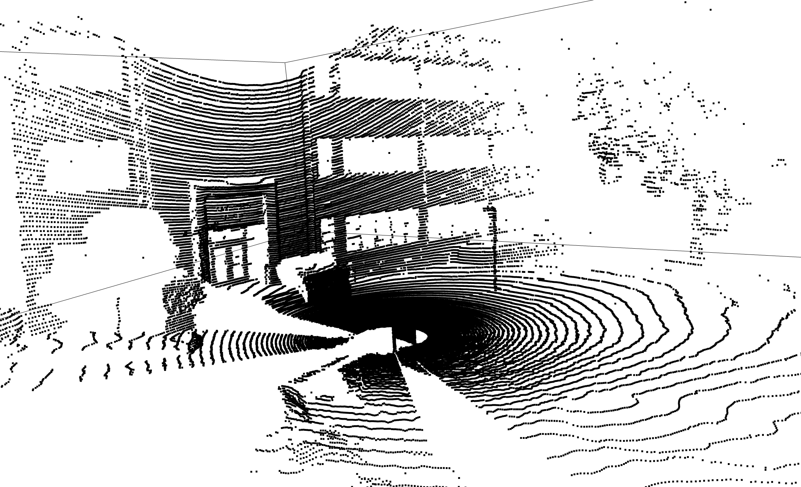
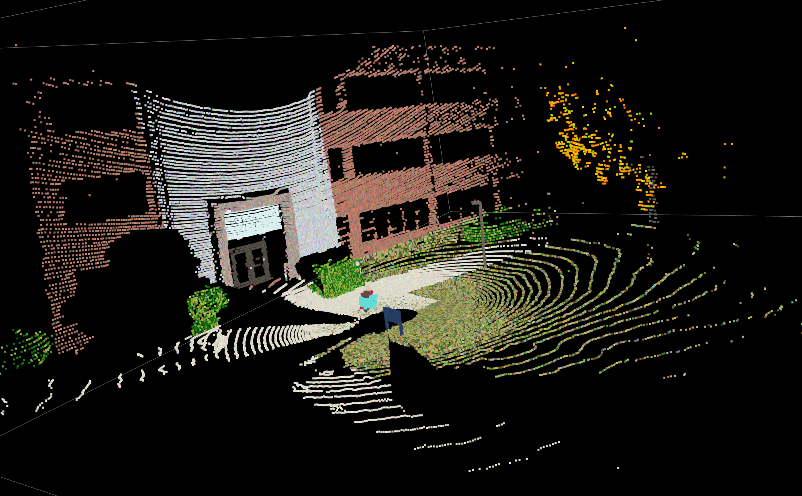
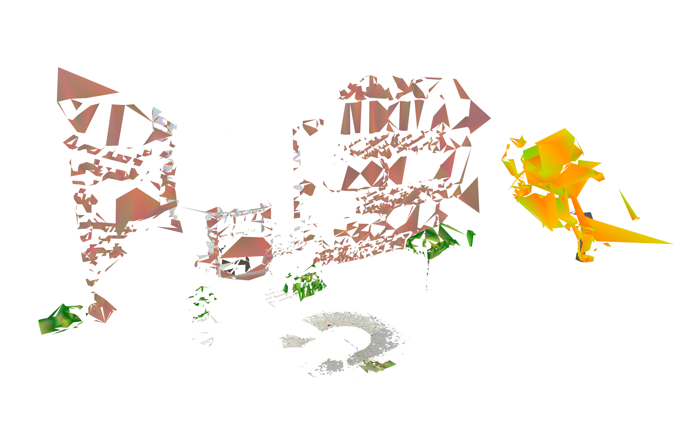
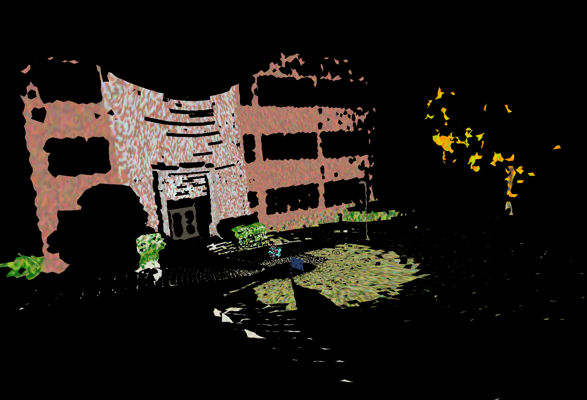

# Example pipeline for point cloud data (PCD) manipulation
Using Open3D, the PCD can be downsampled, outliers removed, normals estimated, and mesh created.
Definition and colorization of individual objects is done manually, but ultimately this should be automated.

**Table of Contents**
1. [Directories](#dirs)
2. [Notebooks](#books)
3. [Scripts](#scripts)
4. [Install and Usage](#usage)
   
### Raw data, no objects defined

### Final scene loaded and visualized as single .ply file

### Suboptimal Colorized Mesh Created in Open3D (Ball Pivoting)

### Suboptimal Colorized Mesh Created in MeshLab (Ball Pivoting)

## Directories 
- Data : contains point cloud data in a `.csv`.
- Images : contains screenshots of example outputs.
- Objects : contains predefined objects from the Monroe Hall outdoor scene.

## Notebooks 
- `example_pipeline.ipynb` : example pipeline usage for manipulating point cloud data.
- `example_visual.ipynb` : example of loading and visualizing a previously colorized scene.
- `mesh_by_object.ipynb` : example of creating triangulated mesh of each colorized scene object

## Scripts 
- `pipeline.py` : pipeline as importable function
- `color_palettes.py` : importable color palette functions

## Install and Usage 
1. After downloading/cloning the repo, ensure current directory: `cd colorized_proof_of_concept`.
2. run `chmod +x create_conda_env.sh` and `./create_conda_env.sh`to create the environemnt.
3. Open the notebook in VS Code or Jupyter and test the example notebooks.
